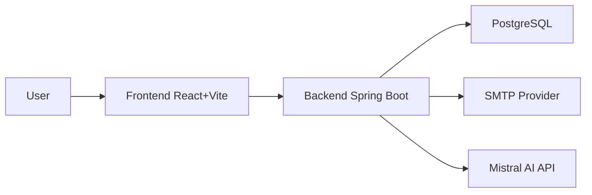
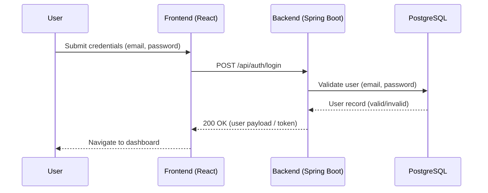
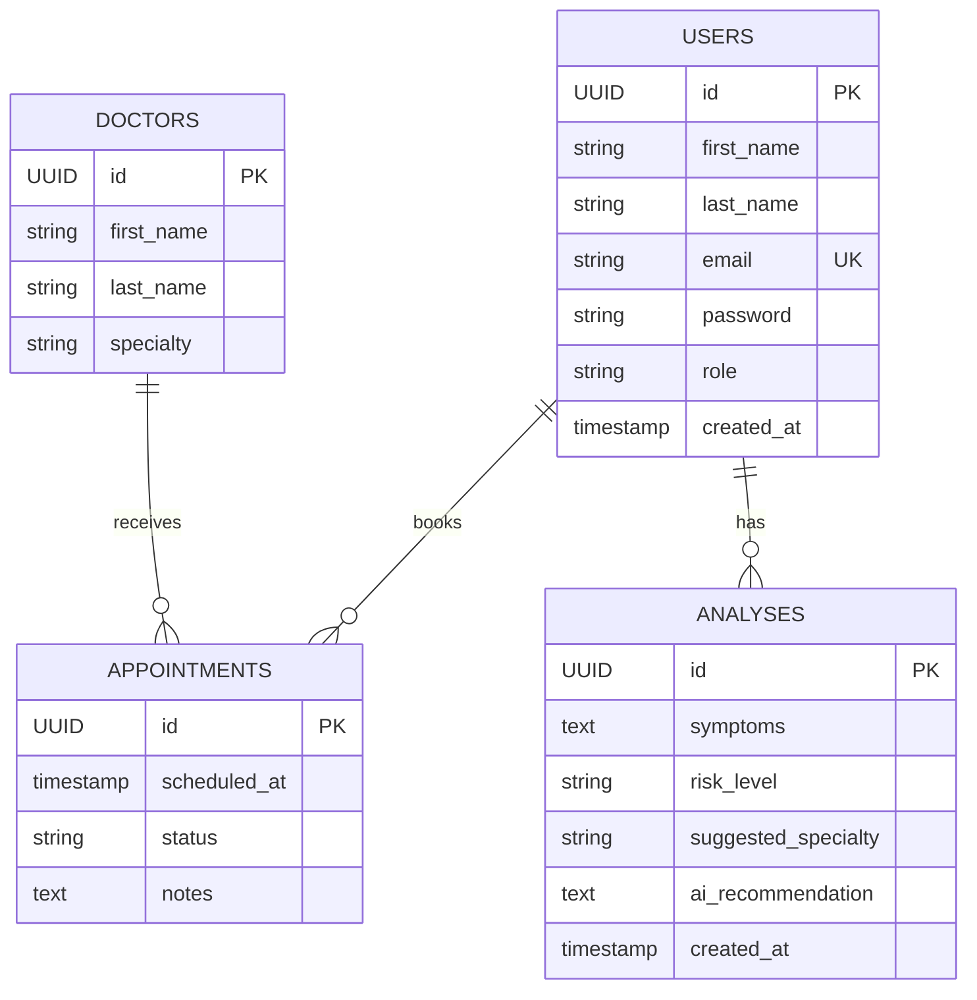

# AI Health Assistant — Monorepo (Backend Spring Boot + Frontend React)

A complete web application where patients can enter symptoms, get AI-assisted analysis, and book appointments with doctors. This repository contains both the backend (Spring Boot) and the frontend (React + Vite).

## Repository Structure

- `pom.xml` — Spring Boot Maven project descriptor
- `src/` — Spring Boot backend source code
- `Frontend AI Health Assistant Application/` — React + TypeScript frontend
- `src/main/resources/application.properties` — Backend config (uses environment variables)
- `src/main/resources/db/migration/` — Flyway migrations (includes demo seed)

## Technology Stack

- Backend: Spring Boot 3 (Java 17), Spring Web, Spring Data JPA, Flyway, PostgreSQL, Lombok, MapStruct
- Frontend: React 18, TypeScript, Vite, Tailwind CSS, React Router, Axios, Lucide React
- Database: PostgreSQL

## Diagrams

### System Architecture



### Login Sequence




### Data Model (ER)




## What I Changed (Sanitization Before Publishing)

- Replaced hardcoded credentials and keys in `src/main/resources/application.properties` with environment variables:
  - `DB_URL`, `DB_USERNAME`, `DB_PASSWORD`
  - `MISTRAL_API_KEY`, `MISTRAL_API_URL`, `MISTRAL_MODEL`
  - `MAIL_USERNAME`, `MAIL_PASSWORD`
- Updated `.gitignore` to ignore `.env` files while allowing `.env.example` templates
- Parameterized the frontend API base URL in `Frontend AI Health Assistant Application/src/services/authService.ts` using `VITE_API_URL`
- Created `Frontend AI Health Assistant Application/.env.example` with `VITE_API_URL`
- Corrected frontend README to reflect Spring Boot backend and local ports
- Removed personal email and sensitive references from frontend README Support section

No source code functionality was degraded by these changes.

## Local Development

### Prerequisites

- Java 17
- Maven
- Node.js (LTS) and npm
- PostgreSQL (local instance)

### Backend (Spring Boot)

1) Set environment variables (examples):

```
DB_URL=jdbc:postgresql://localhost:5432/aihealthdb
DB_USERNAME=postgres
DB_PASSWORD=your-db-password
# Optional integrations
MISTRAL_API_KEY=your-mistral-api-key
MISTRAL_API_URL=https://api.mistral.ai/v1/chat/completions
MISTRAL_MODEL=mistral-small-latest
MAIL_USERNAME=your-email@example.com
MAIL_PASSWORD=your-app-password
```

2) Run the backend:

```
mvn spring-boot:run
```

- Backend runs on `http://localhost:8080`
- API base path expected by frontend: `http://localhost:8080/api`

### Frontend (React + Vite)

1) Create `.env` from example and adjust if needed:

```
# in Frontend AI Health Assistant Application/.env
VITE_API_URL=http://localhost:8080/api
```

2) Install dependencies and start dev server:

```
cd "Frontend AI Health Assistant Application"
npm install
npm run dev
```

- Frontend runs on `http://localhost:5173`

## Demo Accounts (from migration seed)

- Patient: `patient@demo.com` / `password123`
- Admin: `admin@demo.com` / `admin123`

These are intended for local testing only. Change or remove them for production usage.

## Database Migrations

- Flyway migrations live under `src/main/resources/db/migration/`
- On startup, Flyway validates the schema and seeds demo data if needed

## Security Notes

- Do not commit real secrets. `.env` and similar are ignored by `.gitignore`
- All previously hardcoded secrets/emails were removed or parameterized
- Configure SMTP and AI API keys through environment variables

## Known Adjustments You May Want To Make

- Docker: The existing `docker-compose.yml` found under the frontend directory is oriented to a Node/Express backend. If you want Docker support for the current Spring Boot backend, consider creating a new Dockerfile and compose setup for Spring Boot and PostgreSQL.
- Authentication: Ensure password hashing and full auth flows are implemented/validated in the backend before production.
